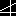
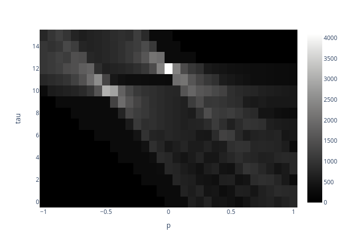
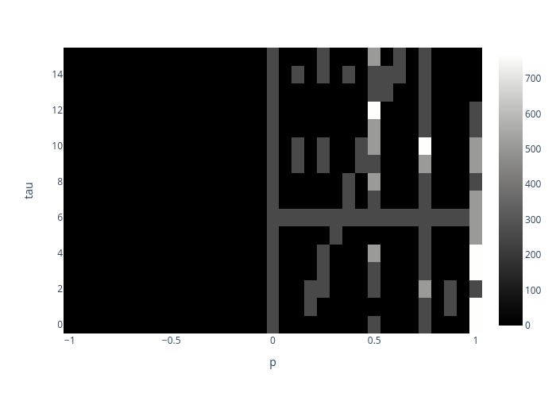

# Descrete Radon Transform
This is an implementation of DRT algorithm
with different interpolation methods:
1. `nearest` --- use nearest-neighbour interpolation;
2. `linear` --- use linear interpolation;
`sinc` --- use Whittaker-Shannon sampling theorem.
All information about DRT and other beautiful stuff can be found [here](https://backend.orbit.dtu.dk/ws/portalfiles/portal/5529668/Binder1.pdf).

## Example
### original

### nearest

### linear

### sinc
Unfortunately, it doesn't work correctly :(

